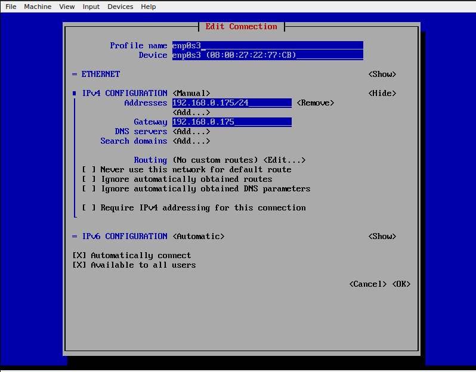
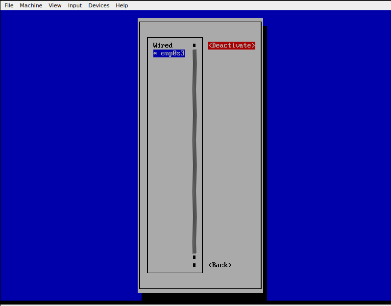

# Table of Contents

- [Table of Contents](#table-of-contents)
    - [Install Postman Agent For Toolbar Icon](#install-postman-agent-for-toolbar-icon)
    - [Vim Whole Guide](#vim-whole-guide)
    - [Remove Ubuntu DOC issue after scrren Lock](#remove-ubuntu-doc-issue-after-scrren-lock)
    - [Vimdiff to see only changed lines](#vimdiff-to-see-only-changed-lines)
    - [Make Virtual Box Static IP NMTUI](#make-virtual-box-static-ip-nmtui)
    - [Take Server Access with ssh-key based auth](#take-server-access-with-ssh-key-based-auth)
    - [Set Github SSH For Two Accounts](#set-github-ssh-for-two-accounts)

### Install Postman Agent For Toolbar Icon

---

- [Steps Here On Github](https://gist.github.com/pmkay/75faa1b926ba06416d0e44a29a584940#file-installing-postman-md)

### Vim Whole Guide

---

- [Vim Guide Link](https://hea-www.harvard.edu/~fine/Tech/vi.html)

### Remove Ubuntu DOC issue after scrren Lock

---

- [Github Page](https://github.com/micheleg/dash-to-dock/issues/649)
- Ok, resolved the issue by removing default ubuntu-dock@ubuntu.com:

```sql
sudo mv /usr/share/gnome-shell/extensions/ubuntu-dock@ubuntu.com ~/
```

### Vimdiff to see only changed lines

---

- [Refer Site](https://unix.stackexchange.com/questions/352199/vimdiff-vim-d-how-to-show-only-the-differences-and-fold-all-identical-line)

```sql
vimdiff -c 'set diffopt=filler,context:0' file1 file2
OR
:set diffopt=filler,context:0
```

### Make Virtual Box Static IP NMTUI

---

1. [Refer Site](https://www.tecmint.com/nmtui-configure-network-connection/)
2. Steps To Do It.
   - Hit the command `nmtui`.
   - Select the first option ‘Edit a connection’ and hit ENTER.
   - Next, select the interface you want to configure and hit ENTER. In this case, the interface we are configuring is enp0s3.
   - Enter the `Address` of your desire and the same for `Gateway` aswell.  
     
   - Then press ENTER on OK.
   - Then press ENTER on back.
   - Then select the `Activate a connection`.  
     
   - Then hit ENTER on deactivate and again hit ENTER on activate.  
     

### Take Server Access with ssh-key based auth

---

To take SSH access of a server without entering the password every time, you can set up passwordless SSH authentication using public key cryptography. Here are the steps to do that:

1. Generate a public/private key pair on your local machine:   
   `ssh-keygen`

- Follow the prompts to create your key pair. By default, the keys will be stored in `~/.ssh/` with the filenames `id_rsa` (private key) and id_rsa.pub (public key).

2. Copy the public key to the remote server:

   `ssh-copy-id user@remote_server`

- Replace "user" with your user on the remote server and "remote_server" with the IP address or hostname of the remote server.
- Enter the password for the remote server when prompted. This will copy the public key to the remote server and add it to the authorized_keys file.
- Once the public key is copied, you should be able to log in to the remote server without a password prompt.
  `ssh user@remote_server`
- This will use your private key to authenticate you on the remote server, and you will not be prompted for a password.
- **Note: If you want to use a specific key for SSH authentication, you can specify it using the -i option:**   
  `ssh -i /path/to/private/key user@remote_server`   
- **Note :-** That the SSH key-based authentication is more secure than password-based authentication because it uses public key cryptography. With this method, the private key is kept on your client machine, and the public key is stored on the remote server. When you connect to the server, the server verifies your identity by using your public key to encrypt a challenge, and your client machine uses the private key to decrypt it and send it back to the server. If the decrypted challenge matches the original challenge, the server knows that you are authorized to access it.

### Set Github SSH For Two Accounts

---

To set the github SSH of multiple different accounts in a single computer. Here are the steps to do that:

1. Generate a public/private key pair on your local machine:   
   `ssh-keygen`

- Follow the prompts to create your key pair. By default, the keys will be stored in `~/.ssh/` with the filenames `id_rsa` (private key) and id_rsa.pub (public key).
- But you need to specify the name of the file for different github accounts.

2. Copy the public key to the remote server:

   `ssh-copy-id -i ~/.ssh/id_rsa_personal.pub user@remote_server`

- Replace "user" with your user on the remote server and "remote_server" with the IP address or hostname of the remote server.
- Enter the password for the remote server when prompted. This will copy the public key to the remote server and add it to the authorized_keys file.
- Once the public key is copied, you should be able to log in to the remote server without a password prompt.
  `ssh user@remote_server`
- This will use your private key to authenticate you on the remote server, and you will not be prompted for a password.
- Now, add edit the config file inside the .ssh folder to tell ssh which ssh key file to use for which host.

```
Host virtual
  HostName nilesh.ameyo.net
  User root
  IdentityFile /home/nileshrawat/.ssh/id_rsa_virtual
  IdentitiesOnly yes

Host personal
  HostName github.com
  User nileshrawatp1
  IdentityFile /home/nileshrawat/.ssh/id_rsa_personal
  IdentitiesOnly yes

# Work account
Host work
  HostName dms-git.ameyo.net
  Port 8265
  User nilesh
  IdentityFile /home/nileshrawat/.ssh/id_rsa_work

```
- Here `Host` is used for the ssh command to use these provided details for access.
- Here `HostName` is the host of the server with which yau want to take the access.
- `User` is the username of the server with which yau want to take the access.
- `IdentityFile` is the private file of key to use for this host.
- `IdentitiesOnly` specifies to use this file only for this host.