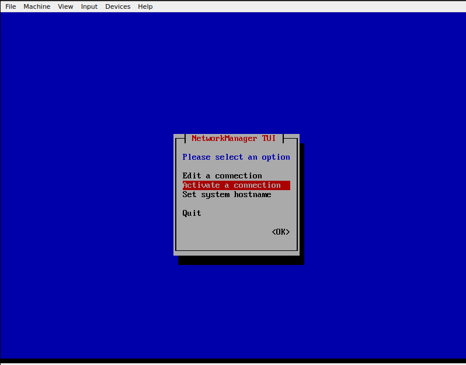

# Table of Contents

- [Table of Contents](#table-of-contents)  
   * [<ins>Install Postman Agent For Toolbar Icon</ins></ins>](#install-postman-agent-for-toolbar-icon)  
   * [<ins>Vim Whole Guide</ins></ins>](#vim-whole-guide)  
   * [<ins>Remove Ubuntu DOC issue after scrren Lock</ins></ins>](#remove-ubuntu-doc-issue-after-scrren-lock)  
   * [<ins>Vimdiff to see only changed lines</ins></ins>](#vimdiff-to-see-only-changed-lines)  
   * [<ins>Make Virtual Box Static IP NMTUI</ins></ins>](#make-virtual-box-static-ip-nmtui)  


### Install Postman Agent For Toolbar Icon
---
- [Steps Here On Github](https://gist.github.com/pmkay/75faa1b926ba06416d0e44a29a584940#file-installing-postman-md)

### Vim Whole Guide
---
- [Vim Guide Link](https://hea-www.harvard.edu/~fine/Tech/vi.html)

### Remove Ubuntu DOC issue after scrren Lock
---
- [Github Page](https://github.com/micheleg/dash-to-dock/issues/649)
- Ok, resolved the issue by removing default ubuntu-dock@ubuntu.com:
```sql
sudo mv /usr/share/gnome-shell/extensions/ubuntu-dock@ubuntu.com ~/
```
### Vimdiff to see only changed lines
---
- [Refer Site](https://unix.stackexchange.com/questions/352199/vimdiff-vim-d-how-to-show-only-the-differences-and-fold-all-identical-line)
```sql
vimdiff -c 'set diffopt=filler,context:0' file1 file2
OR
:set diffopt=filler,context:0
```
### Make Virtual Box Static IP NMTUI
---
1. [Refer Site](https://www.tecmint.com/nmtui-configure-network-connection/)
2. Steps To Do It.
   - Hit the command `nmtui`.
   - Select the first option ‘Edit a connection’ and hit ENTER.  
   - Next, select the interface you want to configure and hit ENTER. In this case, the interface we are configuring is enp0s3.   
   - Enter the `Address` of your desire and the same for `Gateway` aswell.  

   - Then press ENTER on OK.
   - Then press ENTER on back.
   - Then select the `Activate a connection`.  
   
   - Then hit ENTER on deactivate and again hit ENTER on activate.  
   